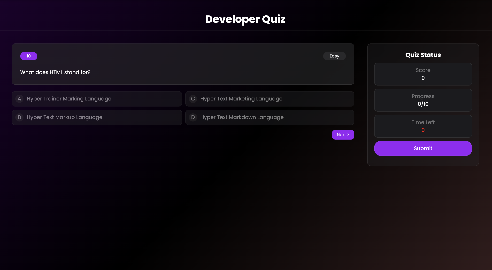

# 🧠 Developer Quiz App

A sleek and responsive web-based quiz application built using **HTML**, **CSS**, and **JavaScript**. The app allows users to test their web development knowledge across multiple questions with features like scoring, progress tracking, a countdown timer, and a result chart powered by **Chart.js**.

## 🚀 Live Demo

👉 [Click here to play the quiz](https://vini4721.github.io/Quiz-App/)

---

## ✨ Features

- ✅ Multiple-choice questions
- ⏱ 30-second countdown timer per question
- 📊 Real-time score and progress updates
- 🟢 Highlights correct and wrong answers
- 📈 Visual result chart using Chart.js
- 🎯 Responsive design for desktop and mobile
- 🧠 Questions include difficulty levels and point values

---

## 📸 Screenshot



---

## 🛠 Tech Stack

- HTML5
- CSS3 (Flexbox & Media Queries)
- JavaScript (DOM Manipulation)
- Chart.js (for result visualization)

---

## 📂 Folder Structure

```
Quiz-App/
├── index.html
├── style.css
├── script.js
├── screenshot.png
└── README.md
```

---

## 📌 How to Run Locally

1. Clone the repository:
   ```bash
   git clone https://github.com/vini4721/Quiz-App.git
   ```
2. Open `index.html` in your browser.

---

## 🙌 Acknowledgements

- Inspired by Frontend Mentor design challenges.
- Chart library used: [Chart.js](https://www.chartjs.org/)

---

## 🧑‍💻 Author

**Vinayak Singh**  
🔗 [GitHub Profile](https://github.com/vini4721)
